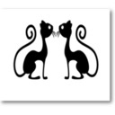

# Testing Extension



## (for jest-puppeteer)
This extension is built to ease creating web tests. It is like Selenium-IDE, but for jest-puppeteer (for now).

Also, this extension records actions on your own browser, so it doesn't need to open up new Selenium or Puppeteer window to record your actions on it.

In recording state it records the events which are stated below with the target elements unique selector.

### Supported Actions

#### Click origined events

| Action Key    | Description   |
| --------------------- | ------------- |
| `click`       | Mouse `click` event. |
| `mousedown`       | Mouse `mousedown` event. |
| `drag-and-drop` | If `mouseup` event comes after `mousedown` event and the difference between their coordinates is greater than 10. |

#### Key originated events

| Action Key    | Description   |
| --------------------- | ------------- |
| `keydown`       | Keyboard `keydown` event. It automaticly gathers the `keydown` events into one if they consecutive triggered and their selectors are the same. |
| `combined-keydown`       | It combines special keydown events if they are trigged at the same time, example: `Ctrl+A`. |

#### Page change events

| Action Key    | Description   |
| --------------------- | ------------- |
| `page-change`       | If `onbeforeunload` event is triggered. |
| `click-page-change` | If `onbeforeunload` event of the window comes after `click` or `mousedown` event. |

#### Verify events

Triggers with right click on the element and choose proper verify action.

| Action Key    | Description   |
| --------------------- | ------------- |
| `verify-text`       | It gets the right clicked element's `text` and matches with the `textContent` of the element in the test. |
| `verify-link`       | It gets the right clicked element's `href` and matches with the `href` of the element in the test. |
| `verify-DOM`       | It gets the right clicked element and check if it exists in the test. |

## Installation

```
git clone https://github.com/omergulen/testing-extension.git
```
Go to `testing-extension` directory run

```
yarn install
```
Now build the extension using
```
yarn build
```
You will see a `build` folder generated inside `[PROJECT_HOME]`

## Adding Testing Extension to Chrome

In Chrome browser, go to `chrome://extensions` page and switch on developer mode. This enables the ability to locally install a Chrome extension.


Now click on the `LOAD UNPACKED` and browse to `[PROJECT_HOME]\build` ,This will install the React app as a Chrome extension.

When you go to any website and click on extension icon, injected page will toggle.


Remove unwanted actions on hover.

## Usage - Testing Environment

### Installation of jest-puppeteer

```bash
# for jest 22~23
yarn add --save-dev jest-puppeteer@3.9.0 puppeteer jest
# for jest 24+
yarn add --save-dev jest-puppeteer puppeteer jest
```
or

```bash
# for jest 22~23
npm install --save-dev jest-puppeteer@3.9.0 puppeteer jest
# for jest 24+
npm install --save-dev jest-puppeteer puppeteer jest
```

### Update Jest configuration

Create `jest.config.js` in the root of your testing environment.

```
module.exports = {
  "preset": "jest-puppeteer"
}
```

### Basic Test Output Code

Following test example in the GIF will generate such code. It starts in [my GitHub Profile](https://github.com/omergulen) and clicks one of the pinned repositories (testing-extension) and when page changes it checks for the repository title's `href` is `https://github.com/omergulen/testing-extension` or not.


```
describe('Test 1', () => {
	beforeAll(async () => {
		await page.goto('https://github.com/omergulen');
	});

	it('Test 1 - 1', async () => {
		await Promise.all([
			page.click(':nth-child(2) > .Box > .pinned-item-list-item-content > .d-flex > .text-bold > .repo'),
			page.waitForNavigation()
		]);
		var nodeLink = await page.$$eval('strong > a', el => el[0].href)
		expect(nodeLink).toBe('https://github.com/omergulen/testing-extension');
	}, 60000);
});
```


### Creating `__tests__` folder

To work with default `jest-puppeteer` preset, you need to put your test files into the `__tests__` folder in the root of your testing environment.

### Update Puppeteer configuration _(optional)_

Create `jest-puppeteer.config.js` in the root of your testing environment.
```
module.exports = {
  launch: {
    headless: false, // Disable headless chromium
    defaultViewport: null // Set page fit to the browser
  },
  browserContext: 'default',
}
```

### Adding `test` command to the project configuration

In your project's `package.json` file, insert `"test": "jest"` line into the `"scripts"` object.

It will basicly look something like that:
```
{
  "scripts": {
    "test": "jest"
  },
  "devDependencies": {
    "jest-puppeteer": "^4.3.0"
  },
  "dependencies": {
    "jest": "^24.8.0",
    "puppeteer": "^1.19.0"
  }
}
```

### Running tests

`yarn run test` or `npm run test` will do.


## Contribution

Bug reports and pull requests are welcome on GitHub at https://github.com/omergulen/testing-extension. This project is intended to be a safe, welcoming space for collaboration, and contributors are expected to adhere to the Contributor Covenant code of conduct


## License

The repo is available as open source under the terms of the [MIT License](http://opensource.org/licenses/MIT).
